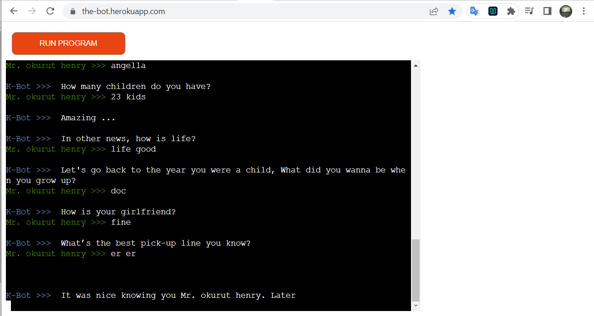
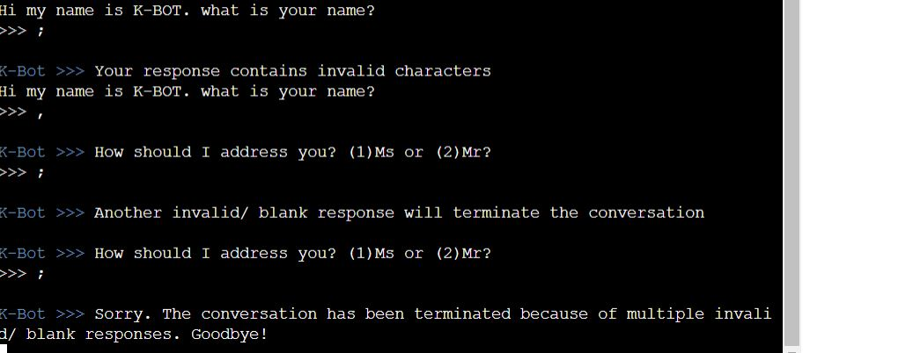

**<h1>The bot</h1>**

The bot is a simple CLI program that can create a customized conversation with a person based on their responses. It has limited topics to discuss because all discussions are created from local files.

Visit our [website](https://the-bot.herokuapp.com/) and play!!!!
<h2>1. Purpose of the project</h2>

The purpose of this project is to demonstrate logic and decision making capability based on a simple pool of information. The program has been trained and tweaked to correct errors and make it more "human" and demonstrate how AI can be used to automate some common repetitive tasks and releave humans of some duties.

<h2>2. User stories</h2>

- As a user I am able to use my keyboard to make responses so that the bot makes a decision
- As a user I am able to freely express myself so that the conversation appears more natural
- The a suser I am able to have a different conversation each time I use the program

<h2>3. Features</h2>

- The bot is a CLI interface deployed on web
- Random question order

<h2>4. Future features</h2>

- Incorporating AI libraries to improve data processing and accuracy of results

<h2>5. Logic behind</h2>

The tentative flow was designed using Ms paint on windows 10 as shown below. After multiple runs, the program was altered based on this initial plan to better adapt the resonses and make them more human-like

The bot works by reading specific words from the the user's response. Incase the response has a positive tone (yes, ofcourse, good, fine ...), this makes the board keep asking more questions related the same topic. Most questions are read from text files that have pre-loaded questions. In order to widen the scope of questions, add more questions in anew line to the text files.

In cases where the response has inappropriate language, the chat conversation is terminated immediately. 

When the user does not respond (empty response or blanks) or the user feeds in random symbols, he/ she is warned 2 times and incase it continues, the conversation is terminated.

<h2>6. Technology</h2>

- The site is built using Python and hosted on Heroku.
- Javascript
- HTML and CSS

**Libraries used**

- [random](https://docs.python.org/3/library/random.html) library used to make the selection of questions unpredictable.
- [re](https://docs.python.org/3/library/re.html) librarry to help in regular expressions and pattern matching.

<h2>7. Testing</h2>

All html elements where tested for intended functionality, all links where tested and the screen responsiveness was verified on mobile, tablet, and desktOp screen resolutions.

<h3>7.1 code validation</h3>

The overall quality of the code was checked using the [python validator](https://pep8ci.herokuapp.com/)

About 4 unique errors were found after using the python PEP8 tester as shown below.

Of all the errors, 3 were fixed using error descriptions in the PEP8 validator. One error (E501) is still visible because splitting the lines to a maximum length of 80 will produce unnecessary spacing in the prompts.

<h3> 7.2 Manual testing</h3>

The bot was tested with invalid input like random symbols and empty responses. 

<h3>8 supported screens and browsers</h3>
 
The site was tested on the browsers listed below

| S/N | Browser         | Version        | Platform       | Screen sizes (mobile, tablet, desktop) |
|-----|-----------------|----------------|----------------|----------------------------------------|
| 1   | Mozilla firefox | 105.0.1        | Windows 10 x64 | Passed all                             |
| 2   | Google Chrome   | 105.0.5195.127 | Windows 10 x64 | Passed all                             |
| 3   | Google Chrome   | 105.0.5195.136 | Android 10     | Passed mobile view                     |

 

<h2>9. Forking and Deployment</h2>

<h3>9.1 Forking the project</h3>
This will make a copy of the project on your github repository.

1. Log into GitHub and locate your repository.
2. On the top left corner, search for "kedi1991/project-flight-sim" and select it from the results.
3. On the right hand side of the page select  **fork** to create and copy of the original under your repository

<h3>9.2 Via gitpod</h3>

To deploy the project using gitpod, run the command `add .` followed by `git commit -m "descripton of code changes to push"` 
Finally, run `git push` to push the changes to yout github repository.

<h3>9.3 Via github pages</h3>

1. While on the project root folder, go to **settings** .
2. Navigate to the **pages** tab on the left navigation panel.
3. Go to **Build and deployment** > **Branch**. Select **main** then click **save**.
4. At the top just below the **GitHub Pages** heading, you will be notified of successful deployment as shown in the image. This may take about 60 seconds to reflect. Incase It takes longer, try refreshing the page.

<h2>10. Known bugs</h2>

1. Because the user is allowed to use their own response from their intuition, the program may not detect some words for accurate responses based on the supplied data used for training.

2. Some questions may be repeated by the program twice.

3. The program cannot detect random meaningless text fed into the chat. It is designed to reject symbols but some genuine conversations may contain such symbols.

4. At some deeper levels of the conversation, the check for invalid input characters may fail, and the program will keep holding the conversation.

<h2>11. credits</h2>

http://www.learnex.in/useful-english-greetings-and-responses/

https://oneminuteenglish.org/en/greetings-in-english/

https://www.jumpspeak.com/blog/english-swear-words

https://www.lihaoyi.com/post/BuildyourownCommandLinewithANSIescapecodes.html

**Thanks to:**
- CI personal mentor - Harry Dhillon for professional guidance
- The CI jul-2022-5p class and tutors

